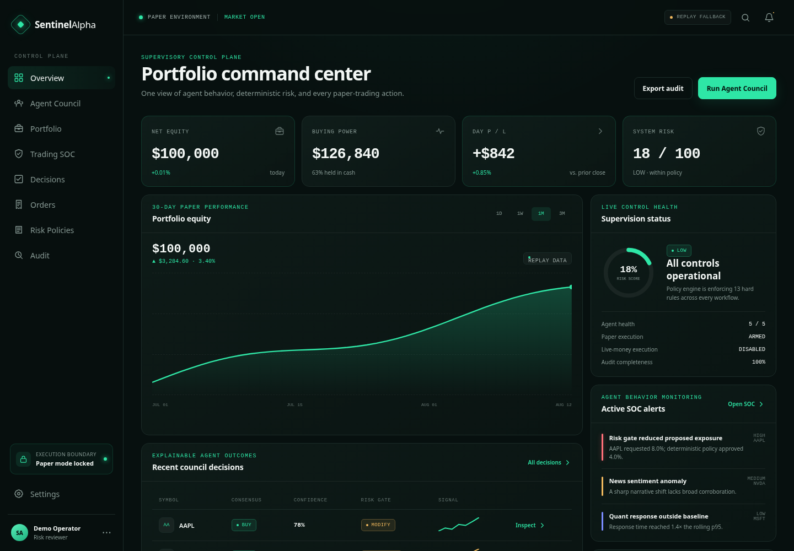

# SentinelAlpha

**An explainable AI portfolio-protection agent for Alpaca options.**

SentinelAlpha is a Track 03 hedging and risk-protection agent. Four bounded analytical agents inspect market, news, quantitative, and portfolio context. A deterministic Hedge Agent decides when protection is justified, selects and sizes a protective put, and sends it through option-specific policy checks. Only the execution service can submit an approved Alpaca paper order through the Alpaca CLI.



> The LLM may reason. The policy engine decides what is permissible. The execution service alone trades. Everything is logged.

## What is implemented

- FastAPI API with typed Pydantic contracts and normalized SQLAlchemy persistence.
- PostgreSQL production stack with Alembic migrations, Redis caching/distributed locks, optimistic row versions, and workflow concurrency guards.
- Market indicator pipeline: SMA, EMA, RSI, MACD, ATR, returns, volatility, volume anomaly, and support/resistance.
- Five-agent council with a stable local replay engine and optional OpenAI Structured Outputs provider.
- Protective-put Hedge Agent with risk scoring, 21–45 DTE contract selection, configurable OTM strikes, integer contract sizing, premium budgeting, and release/rebalance conditions.
- Alpaca option-chain and indicative/OPRA quote ingestion, with hackathon-compliant Alpaca CLI paper execution for options.
- Code-weighted consensus that preserves all individual votes and dissent.
- Fail-closed deterministic checks R001–R014, including paper mode, confidence, agreement, exposure, buying power, freshness, duplicates, daily limits, drawdown, hours, semantic review, volatility, and shorting policy.
- Explicit approval, idempotent paper execution, rejection, and safe replay flows.
- Trading Agent SOC rules and alert queue.
- ExplainTrade decision records and replayable audit timelines.
- ExplainHedge records linking risk components, selected contracts, option controls, execution, and pre-committed release conditions.
- Responsive Next.js dashboard with Overview, Agent Council, Portfolio, SOC, Decisions, Orders, Risk Policies, Audit, and Settings screens.
- Four reliable demo scenarios that do not depend on market hours or external services.

## Safety boundary

```text
Analytical agents
      ↓ structured opinions
Code-derived consensus
      ↓ trade proposal
Semantic risk review
      ↓
Deterministic risk engine
      ↓ APPROVE / MODIFY only
Explicit approval
      ↓
Execution service
      ↓
Alpaca paper trading
```

`LIVE_TRADING_ENABLED=false` is enforced. Agent code has no reference to an order client. Replay orders are labeled `SIMULATED_PAPER`; broker-connected orders are labeled `ALPACA_PAPER`.

Protective puts are submitted as idempotent `BUY_TO_OPEN` limit orders. Live option workflows require the official Alpaca CLI; the Docker API image includes it.

## Quick start

Requirements: Python 3.11+, Node.js 20.9+, and npm.

```bash
cp .env.example .env

# Generate a token, then paste it into API_AUTH_TOKEN in .env.
openssl rand -hex 32

cd apps/api
python -m venv .venv
source .venv/bin/activate
pip install -e '.[dev]'
uvicorn app.main:app --reload
```

In a second terminal:

```bash
cd apps/web
npm install
npm run dev
```

Open [http://localhost:3000](http://localhost:3000), go to **Settings**, and
paste the same token into **Dashboard authentication**. API docs are at
[http://localhost:8000/docs](http://localhost:8000/docs).

Replay mode requires no provider credentials, but operational API routes still
require authentication. Frontend fallback fixtures are visibly labeled and only
activate if the authenticated local API is unavailable.

### Production persistence stack

SQLite remains the zero-setup local default. The Docker stack runs PostgreSQL
and Redis and requires distributed coordination:

```bash
docker compose up --build
```

PostgreSQL stores workflows as normalized rows across market snapshots, portfolio
snapshots and positions, news, agent decisions, consensus, proposals, risk checks,
orders, explanations, alerts, and audit events. Nested evidence/features remain
JSON/JSONB where their shape is inherently document-like; the workflow itself is
reconstructed from relational records.

Manage and verify schema migrations directly with:

```bash
make migrate
make migration-check
```

API startup upgrades to the current Alembic head by default. PostgreSQL startup
migrations use an advisory lock so simultaneous workers cannot apply the same
revision concurrently; set `RUN_MIGRATIONS_ON_STARTUP=false` when migrations are
owned by a separate release job.

`REDIS_REQUIRED=true` is recommended for every multi-worker deployment. Analysis
is locked by mode/symbol, approval and rejection are locked by workflow ID, and
risk-policy changes are locked by policy key. PostgreSQL row locks and optimistic
version columns provide a second concurrency boundary for authoritative writes.
Redis also caches reconstructed workflows and short-lived Alpaca market, news,
clock, and account reads; the deterministic freshness check still rejects stale
market inputs.

### API authentication and authorization

`API_AUTH_ROLE` accepts `viewer`, `operator`, or `admin`. Viewers may inspect
authorized records but cannot create workflows or mutate approvals, orders,
alerts, or risk controls. Operators are restricted to
`API_AUTH_PORTFOLIO_ID`; inaccessible object identifiers return `404` to avoid
identifier disclosure. Admin is the explicit cross-portfolio role.

Production and staging startup fails unless `API_AUTH_TOKEN` contains at least
32 characters. Do not place the token in a `NEXT_PUBLIC_*` variable or commit
it. The dashboard stores a pasted token in browser session storage only.

## Demo flow

1. Open **Hedge Agent** and keep `NVDA`, `REPLAY`, and `Stable demo` selected.
2. Run the portfolio-protection assessment. Four defensive votes feed a deterministic risk score.
3. Inspect the selected put, expiration, strike, hedge ratio, maximum premium, and H001–H017 controls.
4. Approve the protective put. Replay creates one idempotent `SIMULATED_PAPER` option order.
5. Open the full explanation and show when SentinelAlpha will release or rebalance protection.
6. Open **Agent Council** to demonstrate the original equity supervisory workflow and information-risk/SOC scenarios.

The Hedge Agent also exposes an **AUTONOMOUS** execution choice. It only takes
effect when the API has `AUTO_EXECUTE_PAPER=true`; every H001–H017 check still
runs, and the execution service remains locked to Alpaca paper trading. Keep the
default `false` for a human approval checkpoint.

## Optional integrations

### OpenAI agents

Set `OPENAI_API_KEY` and choose the OpenAI engine in Agent Council. The adapter uses the Responses API with Pydantic Structured Outputs. A provider error fails closed to the local bounded agents and is recorded in the workflow timeline; it never creates an order.

### Alpaca paper account

Install the extra and configure paper-account credentials:

```bash
cd apps/api
pip install -e '.[alpaca,dev]'
```

```env
ALPACA_API_KEY=...
ALPACA_SECRET_KEY=...
ALPACA_PAPER=true
ALPACA_TRADING_API_URL=https://paper-api.alpaca.markets/v2
ALPACA_DATA_FEED=iex
ALPACA_OPTIONS_FEED=indicative
ALPACA_OPTIONS_EXECUTION_ADAPTER=cli
LIVE_TRADING_ENABLED=false
```

Then choose `LIVE ALPACA`. The broker adapter always constructs `TradingClient(..., paper=True)` and refuses a non-paper configuration.

Install the official Alpaca CLI for live option execution (the Docker image already includes it):

```bash
go install github.com/alpacahq/cli/cmd/alpaca@latest
alpaca version
```

The service passes the paper credentials to the CLI process and never adds its live-trading flag. Use `ALPACA_OPTIONS_FEED=indicative` for the free indicative options feed or `opra` when the account has OPRA access.

Verify the connection without exposing credentials:

```bash
python scripts/test_alpaca.py
```

The configured REST resource prefix is `https://paper-api.alpaca.markets/v2`.
The SDK receives `https://paper-api.alpaca.markets` as its base host because it
adds `/v2` to individual trading resources itself.
`ALPACA_DATA_FEED=iex` selects the IEX equity feed available to eligible free
accounts. Set `sip` only when the Alpaca account has the required SIP market-data
subscription.

## Verification

```bash
cd apps/api
pytest -q

cd ../web
npm run typecheck
npm run build
npm audit
```

## Repository map

```text
apps/api/app/
  api/router.py              HTTP contract
  services/agents.py         bounded rule/OpenAI agent providers
  services/consensus.py      deterministic weighted aggregation
  services/risk.py           R001–R014 and mutable policy controls
  services/hedging.py        risk score, protective-put selection, H001–H017
  services/soc.py            agent-behavior monitoring
  services/workflow.py       supervised state machine
  services/alpaca.py         the only broker-facing service
  db.py                      normalized persistence and repository reconstruction
  coordination.py            Redis cache, distributed locks, local dev fallback

apps/api/migrations/         Alembic schema and compatibility migrations

apps/web/
  app/                       dashboard routes
  components/                terminal UI and native SVG charts
  lib/api.ts                 typed API client
  lib/demo.ts                visibly labeled offline replay fallback

docs/                        architecture, API, risk model, demo notes
```

## Current MVP boundaries

- US equities and single-leg protective puts; collars and multi-leg spreads remain future extensions.
- Paper trading only.
- SQLite is the zero-setup development default; Docker Compose uses PostgreSQL and Redis for production-style operation.
- Replay orchestration is synchronous for reliability; the SSE endpoint replays stored workflow events.
- Agent recommendations are educational system outputs, not investment advice or a claim of profitability.

## References

- [OpenAI Structured Outputs](https://developers.openai.com/api/docs/guides/structured-outputs)
- [Alpaca-py paper trading](https://alpaca.markets/sdks/python/trading.html)
- [Alpaca-py market data](https://alpaca.markets/sdks/python/market_data.html)
- [Alpaca Trading CLI](https://docs.alpaca.markets/us/docs/alpacas-cli)
- [Alpaca options trading](https://docs.alpaca.markets/us/docs/options-trading)

## License

MIT. See [LICENSE](LICENSE).
